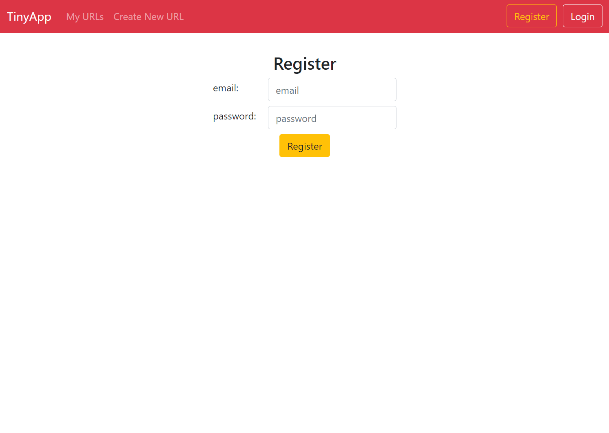
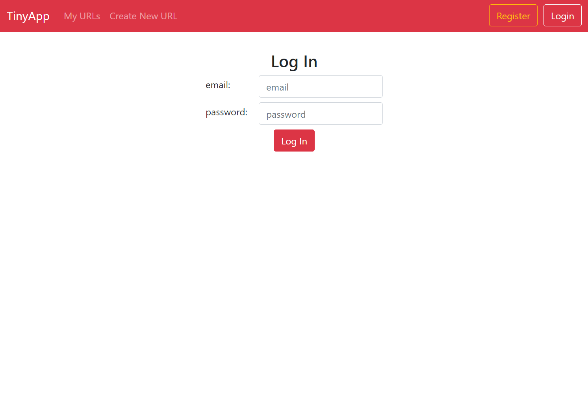
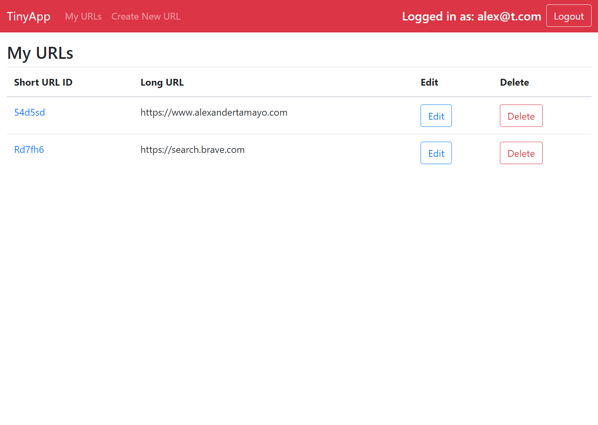
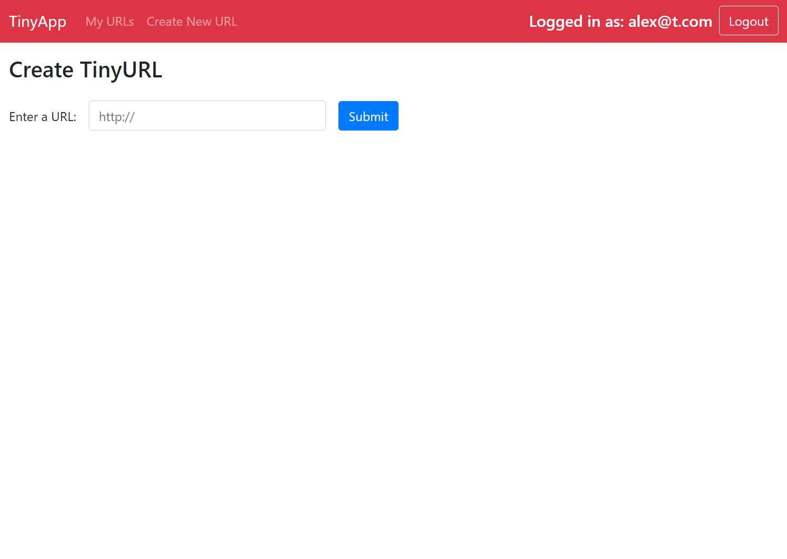

# TinyApp Project

TinyApp is a full stack web application built with Node and Express that allows users to shorten long URLs (à la bit.ly).

## Final Product







## Dependencies

- Node.js
- Express
- EJS
- bcryptjs
- cookie-session
- nodemon

## Getting Started

- Install all dependencies using the command:

```bash
npm install
```

- Run the development web server using the command:

```bash
node express_server.js
```

- Or alternatively

```bash
nodemon express_server.js
```